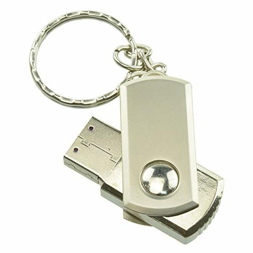

# BadUSB-MultiLocker
Arduino Leonardo Screen Locker BadUSB

Are you tired of your colleagues because they never lock their workstations when they leave their desks?
Just get an ATMEGA32U4, make your cross-platform keyboard-like locker device and teach them a lesson!

You can get one for 5-6$ with a really sophisticated case like this:

## MAKER SURE YOU DON'T VIOLATE ANY OF YOUR COMPANY POLICIES!

Build and upload this little piece of code to your device with [Arduino IDE](https://www.arduino.cc/en/Main/Software "Arduino's download page")
You will need for [Keyboard.h](https://github.com/arduino-libraries/Keyboard/blob/master/src/Keyboard.h) also, but Arduino IDE can handle it.

This code was tested on Windows, Linux and OS X.

Plug it in the back of their device and let the fun begin!
10-20 times locked screen later they will remember to always lock their machine.

## How to protect against these attacks?
* Linux: https://usbguard.github.io/
* Windows: https://docs.microsoft.com/en-us/windows/security/threat-protection/device-control/control-usb-devices-using-intune
